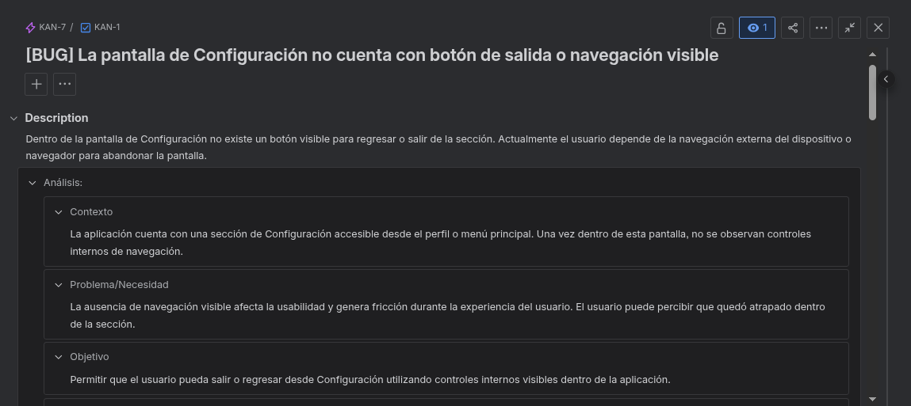
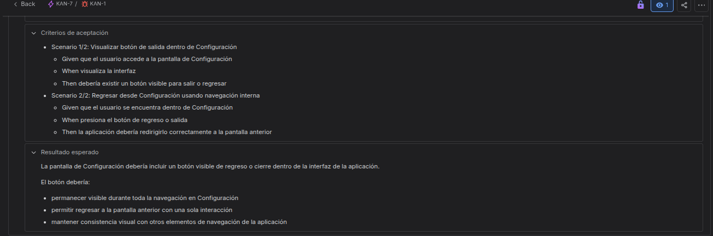
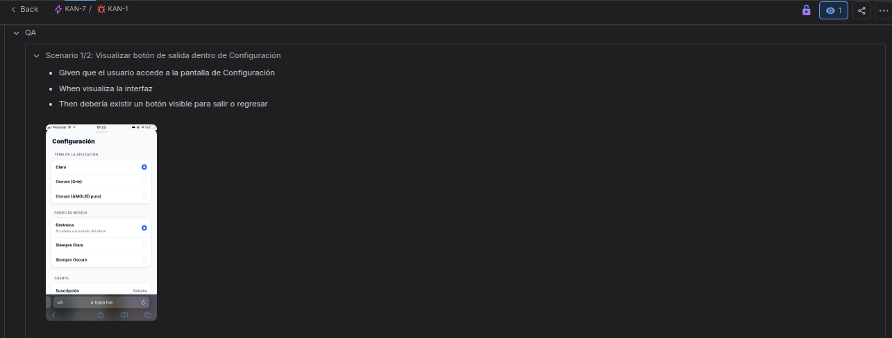
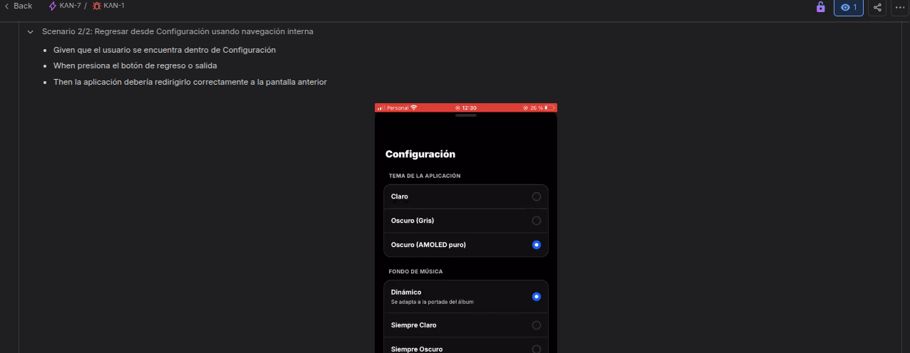
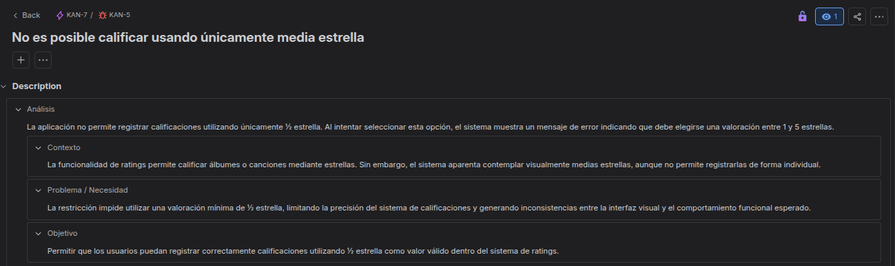
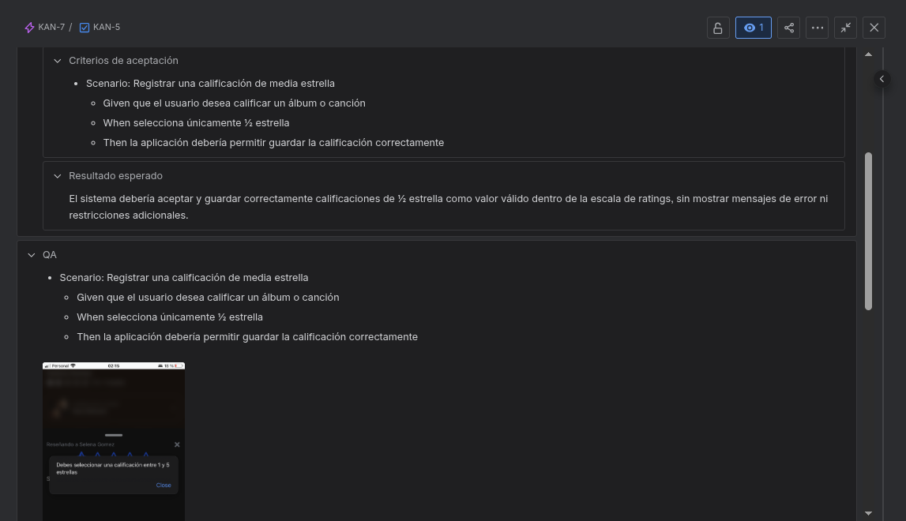

# Bopp QA Testing Project

Personal QA Manual project focused on exploratory testing, bug reporting, and UX/UI improvements for the Bopp beta application.

---

## Project Objective

The purpose of this project is to analyze the behavior of the Bopp beta application through exploratory testing while documenting:

- Functional bugs
- UX/UI improvements
- Navigation issues
- Visual inconsistencies
- User experience observations

---

## Tools & Technologies

- Jira
- Exploratory Testing
- Gherkin
- GitHub
- Screenshots & video evidence

---

## Workflow Methodology

The project follows a Kanban workflow organized into the following stages:

- **Backlog** → detected ideas and issues
- **To Do** → analysis and documentation
- **In Progress** → testing and evidence collection
- **Done** → fully documented ticket

The board is also organized into two main epics:

- **Improvements** → UX/UI enhancements and user experience opportunities
- **Bugs** → Functional, visual, and navigation issues identified during testing

---

## Ticket Structure

Each issue is documented using the following structure:

- Analysis
- Context
- Problem / Need
- Objective
- Acceptance Criteria
- QA
- Expected Result
- Evidence

---

## Types of Issues

### User Stories

- UX/UI improvements
- Search optimization
- Profile image editing

### Bugs

- Navigation issues
- Rating inconsistencies
- Typographical errors
- UI behavior problems

---

## Documented Cases

Some of the documented cases include:

- Missing navigation button in Settings screen
- Half-star rating inconsistencies
- Typo in Top Songs search section
- Missing profile picture adjustment tools
- Inaccurate album search results

---

## Sample Issues

| ID | Type | Summary | Status |
|----|------|---------|--------|
| KAN-1 | Bug | Settings screen has no visible exit or navigation button | Done |
| KAN-2 | User Story | Profile picture adjustment before saving | Done |
| KAN-3 | User Story | Improve accuracy in favorite albums search | Done |
| KAN-4 | Bug | Typo in Top Songs search section | Done |
| KAN-5 | Bug | Unable to rate using only half star | Done |
| KAN-6 | Bug | Half-star rating inconsistency across sections | Done |

---

## Jira Ticket Examples

### KAN-1 — Settings Navigation Bug

#### Analysis & Objective

#### Acceptance Criteria & Expected Result

#### QA Validation — Scenario 1

#### QA Validation — Scenario 2

---

### KAN-5 — Half-Star Rating Validation Bug

#### Analysis & Objective

#### Acceptance Criteria, Expected Result & QA

---

## Testing Approach

This project is based mainly on exploratory testing combined with:

- Scenario validation
- Gherkin acceptance criteria
- Visual evidence collection
- UX analysis
- Functional testing

---

## Evidence

The repository includes:

- Screenshots
- Bug reproduction recordings
- Jira ticket documentation
- Acceptance criteria scenarios

---

## Future Improvements

- Continue exploratory testing coverage
- Add edge-case scenarios
- Expand UX analysis
- Explore future automation possibilities

---
